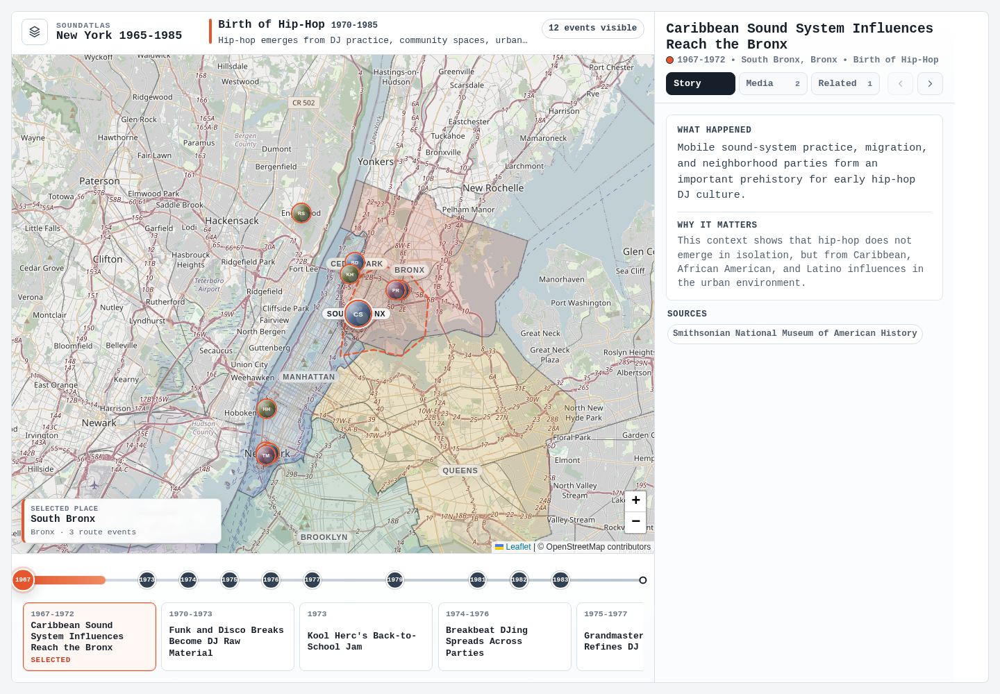

# SoundAtlas



SoundAtlas is an MVP for an interactive music history app. It makes scenes
explorable across place, time, and cultural connection with a map-first UI,
timeline navigation, and a synchronized story panel.

The current product frame is **New York 1965-1985**. The seed data currently
covers five curated routes:

- `Birth of Hip-Hop`
- `Disco To Dance Music`
- `Punk & New Wave Downtown`
- `Salsa & Latin New York`
- `Downtown Experiment / No Wave / Loft Jazz`

The first vertical slice remains **Birth of Hip-Hop: Bronx 1970-1985**.

## Stack

- Frontend: SvelteKit, TypeScript, Leaflet
- Backend: FastAPI, Python 3.13, `uv`
- Data: curated JSON seed files under `data/seed/`

## Quick Start

Requirements:

- Python `>=3.13`
- `uv`
- Node.js and npm
- PowerShell for `scripts/start-dev.ps1`, or Bash for `scripts/start-dev.sh`

### Local

PowerShell:

```powershell
.\scripts\start-dev.ps1
```

Bash:

```sh
./scripts/start-dev.sh
```

Default URLs:

- Frontend: `http://127.0.0.1:5173`
- Backend: `http://127.0.0.1:8000`
- Health: `http://127.0.0.1:8000/health`

### Docker Compose

```sh
docker compose up --build
```

Default URLs:

- Frontend: `http://localhost:5173`
- Backend: `http://localhost:8000`
- Health: `http://localhost:8000/health`

Stop the stack:

```sh
docker compose down
```

### Manual Development

Backend:

```sh
cd backend
uv run uvicorn app.main:app --reload --host 127.0.0.1 --port 8000
```

Frontend:

```sh
cd frontend
VITE_API_BASE_URL=http://127.0.0.1:8000 npm run dev -- --host 127.0.0.1 --port 5173
```

## Checks

Backend:

```sh
cd backend
uv run pytest
```

Frontend:

```sh
cd frontend
npm run check
```

Optional frontend tests:

```sh
cd frontend
npm run test
```

## Data Model

Seed data lives under `data/seed/`:

- `routes.json`
- `places.json`
- `events.json`
- `connections.json`

Key references:

- Seed structure: `docs/data/seed-data-structure.md`
- Seed validation: `docs/data/seed-data-validation.md`
- Editorial workflow: `docs/content/editorial-workflow.md`

## API

The backend is seed-driven and currently exposes:

- `GET /health`
- `GET /routes`
- `GET /places`
- `GET /events`
- `GET /events/{event_id}`
- `GET /connections`
- `PATCH /events/{event_id}/links`
- `PATCH /events/{event_id}/media-links`

## Enrichment

The repository includes media and image enrichment workflows that generate draft
external links for review. No audio, video, or image assets are stored in the
repository.

Useful docs:

- `docs/enrichment/media/overview.md`
- `docs/enrichment/media/youtube-mvp-workflow.md`
- `docs/enrichment/media/workflow-commands.md`
- `docs/enrichment/image/overview.md`
- `docs/enrichment/image/workflow-commands.md`
- `docs/enrichment/upstream/event-search-components.md`

Example dry run:

```sh
cd backend
uv run python scripts/run_youtube_search_requests.py --dry-run
```

Real provider credentials should stay outside the repo. See `.env.example` for
the expected environment variables.

## Project Structure

- `backend/`: FastAPI app, schemas, seed repository, enrichment scripts, tests
- `frontend/`: SvelteKit app, map/timeline/story UI, API client, component tests
- `data/`: curated seed data and enrichment artifacts
- `docs/`: product, design, data, and workflow documentation
- `plans/`: local implementation plan records
- `prompts/`: reusable project prompts
- `scripts/`: local developer startup helpers

## Documentation

- MVP concept: `docs/mvp-concept.md`
- Current task list: `TODO.md`
- Completed work archive: `docs/done.md`
- Dev container workflow: `docs/dev-container.md`
- Implementation plan workflow: `docs/implementation-plan-workflow.md`

## Working Rules

- Keep changes small and aligned with the MVP scope.
- Prefer curated, traceable data over automated aggregation.
- Always include source fields in the data model.
- Do not commit secrets, tokens, or local machine paths.
- Do not add audio files to the repository; use external media links only.
