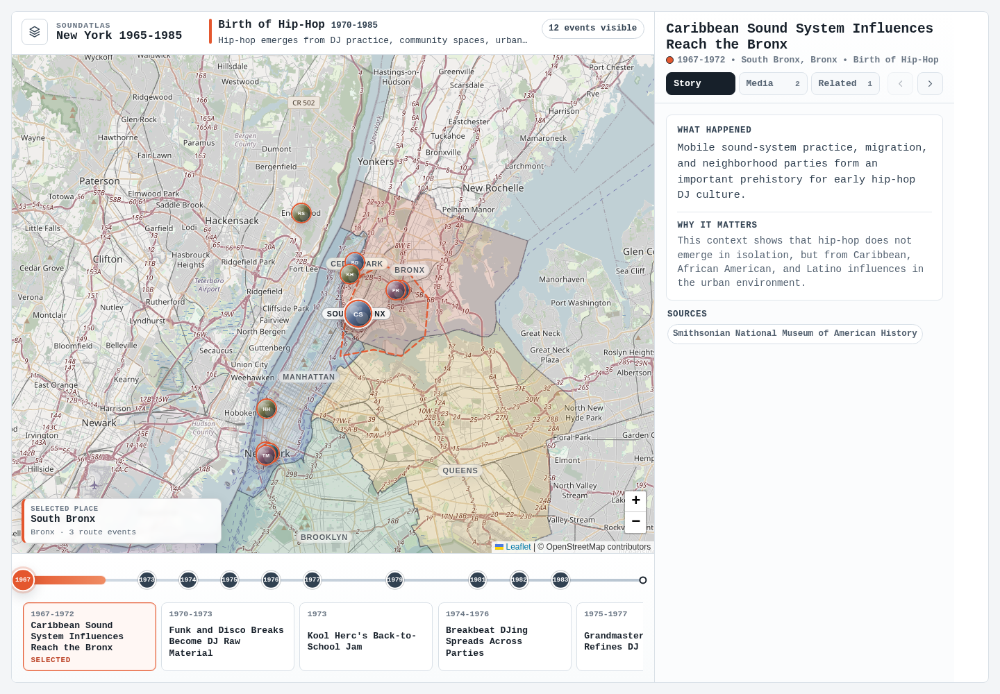

# SoundAtlas



SoundAtlas is an MVP for an interactive music history app. It makes scenes
explorable across place, time, and cultural connection with a map-first UI,
timeline navigation, and a synchronized story panel.

The current product frame is **New York 1965-1985**. The seed data currently
covers five curated routes:

- `Birth of Hip-Hop`
- `Disco To Dance Music`
- `Punk & New Wave Downtown`
- `Salsa & Latin New York`
- `Downtown Experiment / No Wave / Loft Jazz`

The first vertical slice remains **Birth of Hip-Hop: Bronx 1970-1985**.

Deployed page: [gititinyoursoul.github.io/soundatlas](https://gititinyoursoul.github.io/soundatlas/)

## Stack

- Frontend: SvelteKit, TypeScript, Leaflet
- Backend: FastAPI, Python 3.13, `uv`
- Data: curated JSON seed files under `data/seed/`

## Quick Start

Choose one of the two supported development paths.

### Local development

Use this path when Python, `uv`, Node.js, and npm are installed on the host.

For first-time setup, run the dependency installer from the repository root.

PowerShell:

```powershell
.\scripts\setup-dev.ps1
```

Bash:

```sh
./scripts/setup-dev.sh
```

Start both development servers:

PowerShell:

```powershell
.\scripts\start-dev.ps1
```

Bash:

```sh
./scripts/start-dev.sh
```

To start the same local stack in editorial review mode, set
`VITE_EDITORIAL_MODE=true` when launching the startup script.

PowerShell:

```powershell
$env:VITE_EDITORIAL_MODE = "true"
.\scripts\start-dev.ps1
```

Bash:

```sh
VITE_EDITORIAL_MODE=true ./scripts/start-dev.sh
```

Editorial mode requires the local FastAPI backend and API data path; it is not
available in the public static-data build. See the
[`editorial workflow`](docs/content/editorial-workflow.md) for the review and
publication process.

The default frontend URL is `http://127.0.0.1:5173`; the backend health check
is available at `http://127.0.0.1:8000/health`. See
[`docs/local-development.md`](docs/local-development.md) for checks and
troubleshooting.

### Dev Container

Use this path for a reproducible workspace in VS Code or Codex. Docker Compose
and the required external secret files must be available; see the
[`Dev Container documentation`](docs/dev-container.md) for those prerequisites.

In VS Code, open the repository and run `Dev Containers: Reopen in Container`
from the Command Palette.

For a CLI workspace, run from the repository root:

```sh
docker compose -f docker-compose.yml -f .devcontainer/docker-compose.devcontainer.yml up -d --build workspace
docker compose -f docker-compose.yml -f .devcontainer/docker-compose.devcontainer.yml exec --user soundatlas workspace sh .devcontainer/post-create.sh
docker compose -f docker-compose.yml -f .devcontainer/docker-compose.devcontainer.yml exec --user soundatlas workspace bash
```

The workspace commands intentionally run as the non-root `soundatlas` user.
Keep setup and development commands under that same container user so shared
dependency volumes do not become owned by `root`.

The full service, secret, volume, and troubleshooting details remain in
[`docs/dev-container.md`](docs/dev-container.md).

## Build and deployment

The public GitHub Pages deployment is a read-only static frontend. It loads
generated JSON assets from the curated seed files instead of calling the local
FastAPI backend. Build and deployment are handled by the Pages workflow.

## Architecture and data

The system architecture, component boundaries, API overview, and runtime data
flow are documented in [`docs/architecture/`](docs/architecture/README.md).
Seed files remain under `data/seed/`; their contracts and validation rules live
in [`docs/data/`](docs/data/seed-data-structure.md).

The current seed authoring workflow is prompt-guided curation, followed by JSON
validation and backend schema loading. See the [editorial workflow](docs/content/editorial-workflow.md)
and [enrichment documentation](docs/enrichment/workflow.md) for those domain
workflows.

## Enrichment

The repository includes media and image enrichment workflows that generate draft
external links for review. See the [enrichment documentation](docs/enrichment/workflow.md)
for their commands and provider requirements.

## Project Structure

The [system overview](docs/architecture/system-overview.md) documents the
repository components and their boundaries. The top-level areas are:

- `backend/`: FastAPI application and backend tooling
- `frontend/`: SvelteKit application
- `data/`: curated seed data and enrichment artifacts
- `docs/`: product, architecture, design, data, and workflow documentation
- `prompts/`: reusable project prompts
- `scripts/`: local developer startup helpers

## Documentation

- MVP concept: `docs/mvp-concept.md`
- Architecture: `docs/architecture/README.md`
- Planned agent work: GitHub Issues
- Local development: `docs/local-development.md`
- Dev container workflow: `docs/dev-container.md`
- GitHub Issue workflow: `docs/github-issue-workflow.md`
