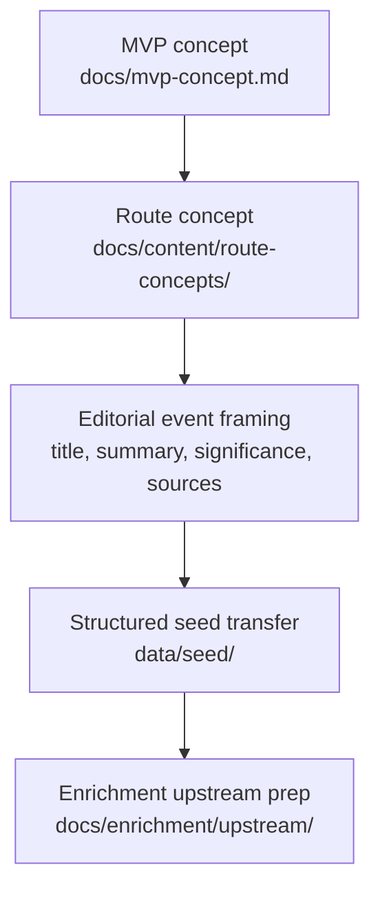

# Editorial Workflow

## Purpose

This document describes how SoundAtlas app-facing editorial content is created
before it is turned into structured seed data.

This layer includes route concepts, event wording, significance text, and other
text that later appears in the product. It is intentionally separate from seed
schema rules and enrichment execution.

## Workflow

## Current Editorial Flow

1. For non-trivial route or content changes, start with
   `prompts/plan-feature.md` and save an approved local implementation plan
   record before broad multi-file edits.
2. Start from the MVP concept in `docs/mvp-concept.md`.
3. Create or revise a route concept in `docs/content/route-concepts/`.
4. Define event titles, summaries, and significance text in editorial form
   before translating them into `data/seed/`.
5. Keep contested or incomplete claims traceable through `source_urls`.
6. Mark uncertain seed records as `review_status: "draft"`.

## Editorial Rules

- Keep event `summary` focused on what happened.
- Keep event `significance` focused on why the event matters.
- Avoid overstating contested historical claims.
- Use explicit artist, place, work, and organization names when they matter.
- Treat route concepts as editorial source documents, not as the runtime data
  model.

## Future Direction

This layer will likely absorb more of the app text-creation workflow over time.
That future work should stay in `docs/content/` rather than being folded back
into seed schema or enrichment execution docs.

## Related Docs

- `docs/mvp-concept.md`
- `docs/content/route-concepts/`
- `docs/data/seed-data-structure.md`
- `docs/data/seed-data-validation.md`
- `docs/enrichment/upstream/query-input-quality.md`
