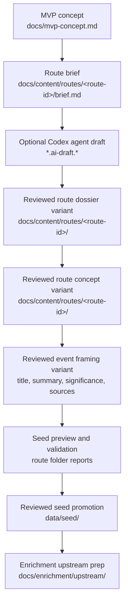

# Editorial Workflow

## Purpose

This document describes how SoundAtlas app-facing editorial content is created
before it is turned into structured seed data.

This layer includes route concepts, event wording, significance text, and other
text that later appears in the product. It is intentionally separate from seed
schema rules and enrichment execution.
In practice, route work should move through reviewable route-folder artifacts
before seed data is changed. The route content pipeline can create and refresh
those artifacts, but human editorial review still decides which claims, events,
places, and connections are ready for seed promotion.

## Workflow



## Current Editorial Flow

1. For non-trivial route or content changes, start with
   `prompts/plan-feature.md` and create or update a GitHub Issue Plan Update
   before broad multi-file edits.
2. Start from the MVP concept in `docs/mvp-concept.md`.
3. For new route content, create a route folder under
   `docs/content/routes/<route-id>/` and begin with `brief.md`.
4. Add or revise route-specific content in that folder. A route folder may
   contain `brief.md`, a research dossier, a concept file, and any
   route-specific notes.
5. Existing documents under `docs/content/route-concepts/` remain valid legacy
   route concepts until a separate migration moves them into per-route folders.
6. For route work, create or update a route research dossier using
   `docs/content/route-editorial-quality-standards.md` before seed transfer.
7. Initialize the route content pipeline when the route has a dossier:
   `uv run --project backend python backend/scripts/route_content_pipeline.py init --route-id <route-id>`.
8. Generate reviewable downstream artifacts with the route content pipeline.
   Use `run --missing` to create only missing steps, or `run --renew` when a
   changed upstream artifact should replace existing downstream drafts.
9. When editorial production should be automated, use the `agent` command to
   generate Codex CLI prompts or invoke Codex CLI for one route step.
10. Review each generated artifact in the route folder before treating it as the
    input to the next editorial decision.
11. Agent-generated outputs default to draft. Use explicit review promotion to
    create reviewed variants before committing them or allowing them to shape
    seed-ready artifacts.
12. Define event titles, summaries, and significance text in editorial form
    before translating them into `data/seed/`.
13. Use the generated seed preview and validation report to inspect draft seed
    shape before any write into `data/seed/`.
14. Promote route drafts to seed only after event framing has been manually
    reviewed and marked reviewed in the route pipeline manifest.
15. Keep contested or incomplete claims traceable through `source_urls`.
16. Mark uncertain seed records as `review_status: "draft"`.
17. Use `prompts/create-route.md` when route concept work needs agent-written
    editorial content beyond deterministic pipeline artifacts.
18. Use `prompts/curate-seed-data.md` when the main task is to add or revise
    JSON seed records directly.

## Route Folder Artifacts

For new route work, keep route-specific editorial artifacts under
`docs/content/routes/<route-id>/`. The preferred sequence is:

1. `brief.md`: route idea, question, thesis hypothesis, research targets, and
   risks.
2. `research-dossier.md` or a named dossier variant such as
   `research-dossier-mvp-edit.md`: source directions, candidate events,
   candidate connections, and editorial risks.
3. `pipeline.json`: route-local pipeline state, active dossier, step outputs,
   and review statuses.
4. `*.ai-draft.*`: local draft Codex CLI prompts, raw outputs, and run
   metadata. These files live in the route folder and are ignored by git.
5. `*-agent-reviewed.*`: reviewed variants created only after a human review
   action. These are the agent artifacts intended to become commit candidates.
6. `event-list.md` and `event-list.json`: candidate events extracted from the
   active dossier for editorial review.
7. `route-concept.md`: route argument and phase draft based on the event list.
8. `event-framing.md`, `event-framing.json`, `place-framing.json`, and
   `connection-framing.json`: draft seed-shaped records for review.
9. `seed-transfer-report.md`: preview of what would be merged into seed files.
10. `validation-report.md`: structural and reference validation findings.

The generated files are working drafts. They should not be treated as final
historical claims or publication-ready seed data without review.

## Pipeline Commands

Use `docs/content/workflow-commands.md` as the command reference for the route
content pipeline.

Common commands:

```bash
uv run --project backend python backend/scripts/route_content_pipeline.py init --route-id birth-of-hip-hop
uv run --project backend python backend/scripts/route_content_pipeline.py agent --route-id birth-of-hip-hop --step brief_to_dossier --dry-run
uv run --project backend python backend/scripts/route_content_pipeline.py run --route-id birth-of-hip-hop --missing
uv run --project backend python backend/scripts/route_content_pipeline.py run --route-id birth-of-hip-hop --renew
uv run --project backend python backend/scripts/route_content_pipeline.py status --route-id birth-of-hip-hop
uv run --project backend python backend/scripts/route_content_pipeline.py promote --route-id birth-of-hip-hop --to-seed
```

## Editorial Rules

- Keep event `summary` focused on what happened.
- Keep event `significance` focused on why the event matters.
- Avoid overstating contested historical claims.
- Use explicit artist, place, work, and organization names when they matter.
- Treat route briefs, dossiers, and concepts as editorial source documents, not
  as the runtime data model.
- Treat generated pipeline artifacts as drafts until reviewed.
- Treat Codex CLI outputs as local drafts until they are explicitly marked
  reviewed and copied into a reviewed route-folder variant.
- Prefer `promote --to-seed` as a dry-run preview before using
  `promote --to-seed --write`.
- Commit only reviewed route content artifacts, not raw agent prompts, outputs,
  or run metadata.

## Future Direction

This layer will likely absorb more of the app text-creation workflow over time.
That future work should stay in `docs/content/` rather than being folded back
into seed schema or enrichment execution docs.

## Related Docs

- `docs/mvp-concept.md`
- `docs/content/routes/`
- `docs/content/workflow-commands.md`
- `docs/content/route-concepts/` legacy route concepts
- `docs/content/route-editorial-quality-standards.md`
- `docs/data/seed-data-structure.md`
- `docs/data/seed-data-validation.md`
- `docs/enrichment/upstream/query-input-quality.md`
