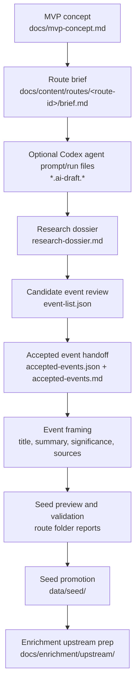

# Editorial Workflow

## Purpose

This document describes how SoundAtlas app-facing editorial content is created
before it is turned into structured seed data.

This layer includes route concepts, event wording, significance text, and other
text that later appears in the product. It is intentionally separate from seed
schema rules and enrichment execution.
In practice, route work should move through checkable route-folder artifacts
before seed data is changed. The route content pipeline can create and refresh
those artifacts, but human editorial review still decides which claims, events,
places, and connections are ready for seed promotion.

## Workflow



## Current Editorial Flow

1. For non-trivial route or content changes, start with
   `prompts/grill-me.md` to critique scope, source risk, editorial boundaries,
   and publication readiness. Use `soundatlas-implementation-planning` to
   create or update a GitHub Issue Plan Update before broad multi-file edits.
2. Start from the MVP concept in `docs/mvp-concept.md`.
3. For new route content, create a route folder under
   `docs/content/routes/<route-id>/` and begin with `brief.md`.
4. Add or revise route-specific content in that folder. A route folder may
   contain `brief.md`, a research dossier, a concept file, and any
   route-specific notes.
5. Existing documents under `docs/content/route-concepts/` remain valid legacy
   route concepts until a separate migration moves them into per-route folders.
6. For route work, create or update a route research dossier using
   `docs/content/route-editorial-quality-standards.md` before seed transfer.
7. Initialize the route content pipeline when the route has a dossier:
   `uv run --project backend python backend/scripts/route_content_pipeline.py init --route-id <route-id>`.
8. Generate checkable downstream artifacts with the route content pipeline.
   Use `run --missing` to create only missing steps, or `run --renew` when a
   changed upstream artifact should replace existing downstream drafts.
9. When editorial production should be automated, use the `agent` command to
   generate Codex CLI prompts or invoke Codex CLI for one route step.
10. Review each generated artifact in the route folder before treating it as the
    input to the next editorial decision.
11. After human candidate review, create or update `accepted-events.json` as
    the structured accepted-event handoff. Include only `keep` candidates and
    human-resolved `merge` outcomes.
12. Use `accepted-events.md` as the human-readable companion dossier. The
    pipeline generates it only when missing by default, or refreshes it with
    `--renew`.
13. Treat accepted-event handoff files as enrichment-ready, not
    publication-ready. AI may draft dossier content and suggest source
    statuses, but human editors confirm source status and source/media
    readiness.
14. Run the event editorial quality pass from
    `docs/content/event-editorial-quality-standards.md` before translating
    accepted events into `data/seed/`.
15. Define event titles, summaries, and significance text in editorial form
    before translating them into `data/seed/`.
16. Use the generated seed preview and validation report to inspect draft seed
    shape before any write into `data/seed/`.
17. Promote route drafts to seed only after event framing has been manually
    inspected.
18. Keep contested or incomplete claims traceable through `source_urls`.
19. Mark uncertain seed records as `review_status: "draft"`.
20. Use `prompts/create-route.md` when route concept work needs agent-written
    editorial content beyond deterministic pipeline artifacts.
21. Use `prompts/curate-seed-data.md` when the main task is to add or revise
    JSON seed records directly.

## Route Folder Artifacts

For new route work, keep route-specific editorial artifacts under
`docs/content/routes/<route-id>/`. The preferred sequence is:

1. `brief.md`: route idea, question, thesis hypothesis, research targets, and
   risks.
2. `research-dossier.md`: source directions, candidate events,
   candidate connections, and editorial risks.
3. `pipeline.json`: route-local pipeline state, active dossier, step outputs,
   and default filenames.
4. `*.ai-draft.*`: local Codex CLI prompt and run metadata files. These files
   live in the route folder and are ignored by git.
5. Named variants such as `event-list.alternate-draft.json` or
   `route-concept.alternate-draft.md` when alternate editorial drafts are
   useful.
6. `event-list.md` and `event-list.json`: candidate events extracted from the
   active dossier for editorial review.
7. `accepted-events.json`: structured accepted-event handoff created after
   human candidate review. Include only `keep` candidates and resolved `merge`
   outcomes. Required quality flags must pass before downstream route concept,
   event framing, seed preview, promotion, or post-review agent steps proceed.
8. `accepted-events.md`: human-readable accepted-event dossier companion. This
   artifact is generated from `accepted-events.json` when missing by default
   and is enrichment-ready, not publication-ready.
9. `route-concept.md`: route argument and phase draft based on the accepted
   event set and candidate-review decisions.
10. `event-framing.md`, `event-framing.json`, `place-framing.json`, and
   `connection-framing.json`: draft seed-shaped records for review.
11. `seed-transfer-report.md`: preview of what would be merged into seed files.
12. `validation-report.md`: structural, reference, and accepted-events gate
    findings.

The generated files are working drafts. They should not be treated as final
historical claims or publication-ready seed data without review.

The route content pipeline uses `accepted-events.json` as the enforcement
contract. `accepted-events.md` remains the readable editorial dossier and is not
parsed as the source of truth.

## Pipeline Commands

Use `docs/content/workflow-commands.md` as the command reference for the route
content pipeline.

Common commands:

```bash
uv run --project backend python backend/scripts/route_content_pipeline.py init --route-id birth-of-hip-hop
uv run --project backend python backend/scripts/route_content_pipeline.py agent --route-id birth-of-hip-hop --step brief_to_dossier --dry-run
uv run --project backend python backend/scripts/route_content_pipeline.py run --route-id birth-of-hip-hop --missing
uv run --project backend python backend/scripts/route_content_pipeline.py run --route-id birth-of-hip-hop --renew
uv run --project backend python backend/scripts/route_content_pipeline.py status --route-id birth-of-hip-hop
uv run --project backend python backend/scripts/route_content_pipeline.py promote --route-id birth-of-hip-hop --to-seed
```

## Editorial Rules

- Keep event `summary` focused on what happened.
- Keep event `significance` focused on why the event matters.
- Avoid overstating contested historical claims.
- Use explicit artist, place, work, and organization names when they matter.
- Treat route briefs, dossiers, and concepts as editorial source documents, not
  as the runtime data model.
- Treat generated pipeline artifacts as drafts until reviewed.
- Create accepted-event dossiers only after human candidate selection. Do not
  move unresolved `maybe`, unresolved `merge`, or `reject` candidates into
  enrichment or seed framing.
- Treat older `develop`, `context`, and `defer` candidate labels as draft
  labels only. Convert them to `keep`, `maybe`, `merge`, or `reject` only after
  human review.
- Keep candidate decisions separate from seed `review_status`. `review_status`
  describes a structured seed/runtime record; it does not decide whether a
  candidate belongs in the route.
- Use source status values only as source/claim quality signals:
  `strong`, `medium`, `weak`, `mythologized`, and `needs_review`. AI-suggested
  source statuses remain unconfirmed until human review.
- Prefer `promote --to-seed` as a dry-run preview before using
  `promote --to-seed --write`.
- Commit route content artifacts only after inspecting them. Do not commit raw
  agent prompt or run metadata files.

## Future Direction

This layer will likely absorb more of the app text-creation workflow over time.
That future work should stay in `docs/content/` rather than being folded back
into seed schema or enrichment execution docs.

## Related Docs

- `docs/mvp-concept.md`
- `docs/content/routes/`
- `docs/content/editorial-process-alignment.md`
- `docs/content/accepted-event-dossier-template.md`
- `docs/content/event-editorial-quality-standards.md`
- `docs/content/workflow-commands.md`
- `docs/content/route-concepts/` legacy route concepts
- `docs/content/route-editorial-quality-standards.md`
- `docs/data/seed-data-structure.md`
- `docs/data/seed-data-validation.md`
- `docs/enrichment/upstream/query-input-quality.md`
