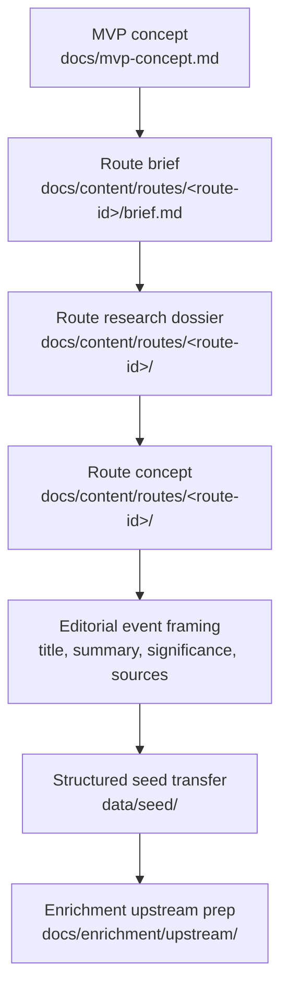

# Editorial Workflow

## Purpose

This document describes how SoundAtlas app-facing editorial content is created
before it is turned into structured seed data.

This layer includes route concepts, event wording, significance text, and other
text that later appears in the product. It is intentionally separate from seed
schema rules and enrichment execution.
In practice, this editorial-to-seed step is usually performed through the repo
prompt files plus human review, rather than through a dedicated seed generation
script.

## Workflow

## Current Editorial Flow

1. For non-trivial route or content changes, start with
   `prompts/plan-feature.md` and create or update a GitHub Issue Plan Update
   before broad multi-file edits.
2. Start from the MVP concept in `docs/mvp-concept.md`.
3. For new route content, create a route folder under
   `docs/content/routes/<route-id>/` and begin with `brief.md`.
4. Add or revise route-specific content in that folder. A route folder may
   contain `brief.md`, a research dossier, a concept file, and any
   route-specific notes.
5. Existing documents under `docs/content/route-concepts/` remain valid legacy
   route concepts until a separate migration moves them into per-route folders.
6. For route work, create or update a route research dossier using
   `docs/content/route-editorial-quality-standards.md` before seed transfer.
7. Use `prompts/create-route.md` when route concept work should also produce a
   seed data plan or seed edits.
8. Use `prompts/curate-seed-data.md` when the main task is to add or revise the
   JSON seed records directly.
9. Define event titles, summaries, and significance text in editorial form
   before translating them into `data/seed/`.
10. Keep contested or incomplete claims traceable through `source_urls`.
11. Mark uncertain seed records as `review_status: "draft"`.

## Editorial Rules

- Keep event `summary` focused on what happened.
- Keep event `significance` focused on why the event matters.
- Avoid overstating contested historical claims.
- Use explicit artist, place, work, and organization names when they matter.
- Treat route briefs, dossiers, and concepts as editorial source documents, not
  as the runtime data model.

## Future Direction

This layer will likely absorb more of the app text-creation workflow over time.
That future work should stay in `docs/content/` rather than being folded back
into seed schema or enrichment execution docs.

## Related Docs

- `docs/mvp-concept.md`
- `docs/content/routes/`
- `docs/content/route-concepts/` legacy route concepts
- `docs/content/route-editorial-quality-standards.md`
- `docs/data/seed-data-structure.md`
- `docs/data/seed-data-validation.md`
- `docs/enrichment/upstream/query-input-quality.md`
