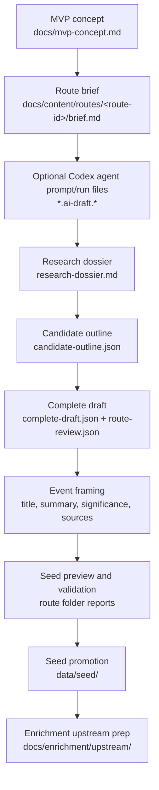

# Editorial Workflow

The canonical state vocabulary is defined in
[`editorial-review-terminology.md`](editorial-review-terminology.md). Legacy
pipeline artifacts may use the names documented below only at migration input
boundaries; newly generated payloads use the canonical names.

Connections are deferred from the MVP because their current implementation is
not developed enough to add sufficient user value while still adding editorial
and runtime complexity. New pipeline runs do not propose or publish them;
existing records remain readable temporarily for compatibility.

## Purpose

This document describes how SoundAtlas app-facing editorial content is created
before it is turned into structured seed data.

This layer includes route concepts, event wording, significance text, and other
text that later appears in the product. It is intentionally separate from seed
schema rules and enrichment execution.
In practice, route work should move through checkable route-folder artifacts
before seed data is changed. The route content pipeline can create and refresh
those artifacts, but human editorial review still decides which claims, events,
places, and connections are ready for seed promotion.

The workflow should minimize required human input. Agent-generated artifacts
should lead with concrete recommendations, counts, merge targets, rationales,
and review questions so a human can approve, reject, or correct decisions
instead of reconstructing the decision from raw notes.

## Interaction Contract

`content-pipeline-interaction-contract.md` defines the normative target
interaction for a thin editorial mode in the existing explorer. It lets the
human inspect a generated route through the map, timeline, and StoryPanel; set
route-scoped Draft, Approved, or Don’t use states; inspect warnings and
publication blocking checks; and publish one exact reviewed result.

The workflow below remains the description of the currently implemented
file-based pipeline. The target interaction does not replace current candidate
recommendations, review states, accepted-event quality flags, or route artifacts
until Issues [#71](https://github.com/gititinyoursoul/soundatlas/issues/71),
[#72](https://github.com/gititinyoursoul/soundatlas/issues/72), and
[#73](https://github.com/gititinyoursoul/soundatlas/issues/73) implement its
review-data, explorer-surface, and publication slices. Completed Issues #70 and
#81 define and implement the current compositional geography behavior.

## Workflow


```mermaid
flowchart TD
  A["MVP concept<br/>docs/mvp-concept.md"] --> B["Route brief<br/>docs/content/routes/&lt;route-id&gt;/brief.md"]
  B --> I["Optional Codex agent prompt/run files<br/>*.ai-draft.*"]
  I --> C["Research dossier<br/>research-dossier.md"]
  C --> D["Candidate outline<br/>candidate-outline.json"]
  D --> K["Complete draft<br/>complete-draft.json + route-review.json"]
  K --> E["Event framing<br/>title, summary, significance, sources"]
  E --> H["Seed preview and validation<br/>route folder reports"]
  H --> F["Seed promotion<br/>data/seed/"]
  F --> G["Enrichment upstream prep<br/>docs/enrichment/upstream/"]
```

## Current Editorial Flow

1. For non-trivial route or content changes, start with
   `soundatlas-grill-me` to critique scope, source risk, editorial boundaries,
   and publication readiness. Use `soundatlas-issue-planning` to
   create or update a GitHub Issue Plan Update before broad multi-file edits.
2. Start from the MVP concept in `docs/mvp-concept.md`.
3. For new route content, create a route folder under
   `docs/content/routes/<route-id>/` and begin with `brief.md`.
4. Add or revise route-specific content in that folder. A route folder may
   contain `brief.md`, a research dossier, a concept file, and any
   route-specific notes.
5. Existing documents under `docs/content/route-concepts/` remain valid legacy
   route concepts until a separate migration moves them into per-route folders.
6. For route work, create or update a route research dossier using
   `docs/content/route-editorial-quality-standards.md` before seed transfer.
7. Initialize the route content pipeline when the route has a dossier:
   `uv run --project backend python backend/scripts/route_content_pipeline.py init --route-id <route-id>`.
8. Generate checkable downstream artifacts with the route content pipeline.
   Use `run --missing` to create only missing steps, or `run --renew` when a
   changed upstream artifact should replace existing downstream drafts.
9. When editorial production should be automated, use the `agent` command to
   generate Codex CLI prompts or invoke Codex CLI for one route step.
10. Review generated artifacts from the highest-signal summary first. For
    candidate review, start with overview counts, cluster recommendations,
    merge decisions, and `maybe` items before reading the full appendix.
11. Keep human input minimal: the agent should propose candidate decisions,
    merge targets, overlap-cluster recommendations, rationales, and review
    questions; the human should normally only approve, reject, or correct those
    proposals.
12. Run the complete-draft agent step after candidate outline generation. It may
    add, omit, merge, split, or reorder proposals, but it must account for
    every outline Candidate and every addition with an outcome, Reason,
    relationships, and reviewable Content/Context. It materializes one coherent
    active result before human editorial decisions.
13. Create or refresh `route-review.json` to keep the private Draft, Approved,
    and Don’t use state separate from agent recommendations. The complete-draft
    step refreshes it after successful activation; existing routes may use the
    explicit one-time legacy migration described in
    `docs/content/workflow-commands.md`.
14. Keep `accepted-events.json` and `accepted-events.md` as legacy compatibility
    artifacts for the deterministic path. They are not required before complete
    drafting and do not determine route-scoped editorial state.
15. Treat the generated route result and editorial review revision as reviewable drafts, not
    publication-ready data. The legacy accepted-event handoff remains
    enrichment-ready compatibility material. AI acquires and compares Sources
    before drafting active reader-facing prose; Human publication remains the
    decision that accepts those Sources as relevant. An active Event without a
    Source URL is visible as a blocking Source finding and cannot be published.
16. Run the event editorial quality pass from
    `docs/content/event-editorial-quality-standards.md` before translating
    accepted events into `data/seed/`.
17. Define event titles, summaries, and significance text in editorial form
    before translating them into `data/seed/`.
18. Use the generated seed preview and validation report to inspect draft seed
    shape before any write into `data/seed/`.
19. Promote route drafts to seed only after event framing has been manually
    inspected.
20. Keep contested or incomplete claims traceable through `source_urls`.
21. Mark uncertain seed records as `review_status: "draft"`.
22. Use `prompts/create-route.md` when route concept work needs agent-written
    editorial content beyond deterministic pipeline artifacts.
23. Use `prompts/curate-seed-data.md` when the main task is to add or revise
    JSON seed records directly.

## Route Folder Artifacts

For new route work, keep route-specific editorial artifacts under
`docs/content/routes/<route-id>/`. The preferred sequence is:

1. `brief.md`: route idea, question, thesis hypothesis, research targets, and
   risks.
2. `research-dossier.md`: source directions, candidate events,
   candidate connections, and editorial risks.
3. `pipeline.json`: route-local pipeline state, active dossier, step outputs,
   and default filenames.
4. `*.ai-draft.*`: local Codex CLI prompt, staged-output, and run metadata
   files. These files live in the route folder and are ignored by git. Run
   metadata identifies the stable agent-step contract version and digest;
   route-specific files remain dynamic inputs to that contract.
5. Named variants such as `event-list.alternate-draft.json` or
   `route-concept.alternate-draft.md` when alternate editorial drafts are
   useful.
6. `candidate-outline.json`: preserved agent-generated candidate outline used
   as input to complete drafting.
7. `complete-draft.json` and `complete-draft.md`: the single generated
   Content/composition authority for one validated Route revision. It contains
   the complete Candidate account, active Event/Place/Connection Content, phase
   coverage, owned findings, publication blocking checks, and source-outline identity.
8. `event-list.md` and `event-list.json`: deterministic active-Candidate views
   materialized from the complete draft for compatibility. `event-list.md`
   should minimize human effort by showing overview counts, overlap-cluster
   recommendations, merge targets, `maybe` items, and then the full candidate
   appendix.
9. `route-review.json`: authoritative route-scoped Human-state record bound to one
   exact generated route result. It keeps Draft, Approved, and Don’t use only on route
   events; other considered candidates retain their composition account and findings but
   do not receive editorial state. It preserves minimal dormant decisions across
   refreshes.

In editorial explorer mode, Route review reports the complete Candidate count
with separate active Event and inactive Candidate sections. Selecting an
inactive Candidate is read-only: its generated Content, composition account,
findings, and resolved place/time context are shown without adding it to the
active Route, publication payload, or public explorer. A disagreement is a
revision request through #85, not an inactive-Candidate state or direct edit.
10. `route-publication.json`: minimal route-scoped record of the exact revision and
   event/connection membership most recently promoted to canonical seed data.
   It protects the published result from later route-review refreshes; it is not
   a run archive or publication history.
11. `accepted-events.json`: legacy structured accepted-event handoff for the
   deterministic compatibility path. Include only approved `keep` candidates
   and resolved `merge` outcomes when using that path; it does not gate the
   active complete-draft result.
12. `accepted-events.md`: optional human-readable companion view for the same
   accepted-events review. This artifact is generated from
   `accepted-events.json` when missing by default and is enrichment-ready, not
   publication-ready. It is not a separate approval gate.
13. `route-concept.md`: route argument and phase draft based on the complete
   draft result.
14. `event-framing.md`, `event-framing.json`, `place-framing.json`, and
   `connection-framing.json`: draft seed-shaped records for review.
15. `seed-transfer-report.md`: preview of what would be merged into seed files.
16. `validation-report.md`: structural, reference, and compatibility-gate
    findings.

The generated files are working drafts. They should not be treated as final
historical claims or publication-ready seed data without review.

The route content pipeline keeps `accepted-events.json` as a legacy
compatibility contract for deterministic commands. The active complete draft is
the only generated Content authority; route concept, event list, and framing
artifacts are its deterministic views, and `route-review.json` binds that exact
Content to route-scoped Human editorial state. Secondary commands must not overwrite selected
complete-draft views. The legacy path is retired separately through #103.

The publication API is available only through API-backed editorial mode:

- `GET /editorial/routes/<route-id>/publication` returns the exact revision
  summary, Draft-plus-Approved inclusion, Don’t use exclusions, warnings, and
  publication blocking checks.
- `POST /editorial/routes/<route-id>/publication` accepts the active review
  revision and promotes the validated result to canonical seed data. It does
  not commit, push, deploy, resolve warnings, or alter route-scoped editorial state.

This remains a focused publication boundary while #72 completes its review
surface evidence and the legacy accepted-events path is retired through the
approved workflow.

## Pipeline Commands

Use `docs/content/workflow-commands.md` as the command reference for the route
content pipeline.

Common commands:

```bash
uv run --project backend python backend/scripts/route_content_pipeline.py init --route-id birth-of-hip-hop
uv run --project backend python backend/scripts/route_content_pipeline.py agent --route-id birth-of-hip-hop --step brief_to_dossier --dry-run
uv run --project backend python backend/scripts/route_content_pipeline.py run --route-id birth-of-hip-hop --missing
uv run --project backend python backend/scripts/route_content_pipeline.py run --route-id birth-of-hip-hop --renew
uv run --project backend python backend/scripts/route_content_pipeline.py review --route-id birth-of-hip-hop
uv run --project backend python backend/scripts/route_content_pipeline.py status --route-id birth-of-hip-hop
uv run --project backend python backend/scripts/route_content_pipeline.py promote --route-id birth-of-hip-hop --to-seed
```

## Editorial Rules

- Keep event `summary` focused on what happened.
- Keep event `significance` focused on why the event matters.
- Avoid overstating contested historical claims.
- Use explicit artist, place, work, and organization names when they matter.
- Treat route briefs, dossiers, and concepts as editorial source documents, not
  as the runtime data model.
- Treat generated pipeline artifacts as drafts until reviewed.
- Minimize human input during review. Agent outputs should propose decisions,
  defaults, merge targets, overlap handling, rationales, and next questions
  before asking for human confirmation.
- Keep generated proposals pending for route editorial review. Do not treat agent
  `keep`, `maybe`, `merge`, or `reject` recommendations as human decisions or
  publication authorization.
- Treat older `develop`, `context`, and `defer` candidate labels as draft
  labels only. Convert them to `keep`, `maybe`, `merge`, or `reject` only after
  human review.
- Keep candidate decisions separate from seed `review_status`. `review_status`
  describes a structured seed/runtime record; it does not decide whether a
  candidate belongs in the route.
- Keep the target Draft, Approved, and Don’t use route-review states separate
  from both candidate recommendations and seed `review_status`.
- Treat `route-review.json` as the authority for private route state. Treat the
  accepted-events gate as a legacy compatibility boundary; the complete-draft
  path does not require it.
- Use source status values only as source/claim quality signals:
  `strong`, `medium`, `weak`, `mythologized`, and `needs_review`. AI-suggested
  source statuses remain unconfirmed until human review.
- Prefer `promote --to-seed` as a dry-run preview before using
  `promote --to-seed --write`.
- Commit route content artifacts only after inspecting them. Do not commit raw
  agent prompt or run metadata files.

## Future Direction

This layer will likely absorb more of the app text-creation workflow over time.
That future work should stay in `docs/content/` rather than being folded back
into seed schema or enrichment execution docs.

## Related Docs

- `docs/mvp-concept.md`
- `docs/content/content-pipeline-interaction-contract.md`
- `docs/content/routes/`
- `docs/content/editorial-process-alignment.md`
- `docs/content/accepted-event-dossier-template.md`
- `docs/content/event-editorial-quality-standards.md`
- `docs/content/workflow-commands.md`
- `docs/content/route-concepts/` legacy route concepts
- `docs/content/route-editorial-quality-standards.md`
- `docs/data/seed-data-structure.md`
- `docs/data/seed-data-validation.md`
- `docs/enrichment/upstream/query-input-quality.md`
