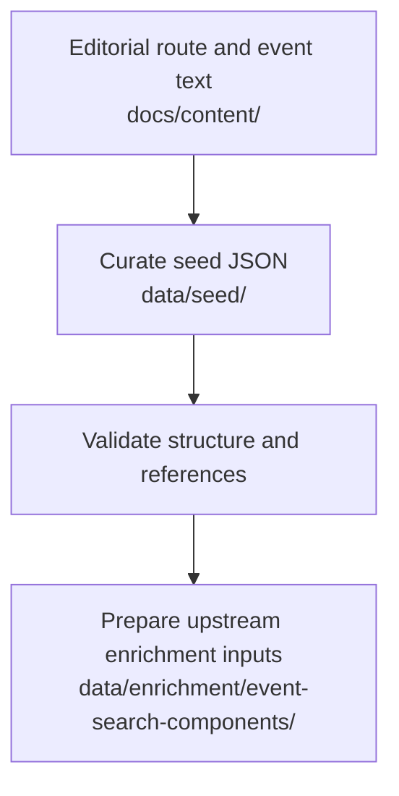

# Seed Data Structure

## Purpose

This document describes how curated SoundAtlas seed data is organized and how
it connects editorial content to enrichment workflows.

Seed data is the structured product layer. It stays smaller and more stable
than the surrounding editorial and enrichment artifacts.

## Seed Files

Seed data lives under `data/seed/`:

- `routes.json`: route metadata
- `places.json`: places with coordinates
- `events.json`: historical events
- `connections.json`: relationships between events

## Workflow Position

## Current Seed Transfer Flow

1. Start from route concepts in `docs/content/route-concepts/`.
2. Update the smallest necessary set of files under `data/seed/`.
3. Keep stable lowercase, URL-safe IDs.
4. Preserve references between routes, places, events, and connections.
5. Validate JSON shape and cross-file references through backend schema loading
   and tests.

## Structural Rules

- Seed files remain the source of truth for runtime map, timeline, story, and
  connection data.
- Retrieval-specific hints should stay outside `data/seed/` when they become
  more detailed than normal prose, tags, places, and sources.
- Use `review_status: "draft"` for uncertain or unreviewed records.

## Related Docs

- `docs/data/seed-data-validation.md`
- `docs/content/editorial-workflow.md`
- `docs/enrichment/workflow.md`
- `docs/enrichment/upstream/event-search-components.md`
