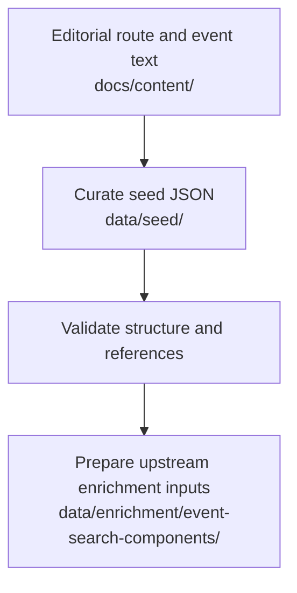

# Seed Data Structure

## Purpose

This document describes how curated SoundAtlas seed data is organized and how
it connects editorial content to enrichment workflows.

Seed data is the structured product layer. It stays smaller and more stable
than the surrounding editorial and enrichment artifacts.
It is currently authored through prompt-guided curation and direct JSON edits,
not generated from a standalone seed-builder script.

## Seed Files

Seed data lives under `data/seed/`:

- `routes.json`: route metadata
- `places.json`: places with coordinates
- `events.json`: historical events
- `connections.json`: relationships between events

## Workflow Position

## Current Seed Transfer Flow

1. Start from route content in `docs/content/routes/<route-id>/` for new route
   work, or from existing legacy concepts in `docs/content/route-concepts/`.
2. Use prompt-driven curation such as `prompts/create-route.md` or
   `prompts/curate-seed-data.md` to draft or revise route and seed content.
3. Update the smallest necessary set of files under `data/seed/`.
4. Keep stable lowercase, URL-safe IDs.
5. Preserve references between routes, places, events, and connections.
6. Validate JSON shape and cross-file references through backend schema loading
   and tests.

## What Is Automated

- `data/seed/` remains the source of truth for routes, places, events, and
  connections.
- `backend/scripts/generate_event_search_components.py` derives enrichment
  helper files from existing seed data into `data/enrichment/`.
- `backend/scripts/enrich_media_links.py` and
  `backend/scripts/enrich_image_links.py` may append draft link metadata to
  existing events in `data/seed/events.json`.
- These scripts do not generate the full route, place, event, or connection
  seed dataset from scratch.

## Structural Rules

- Seed files remain the source of truth for runtime map, timeline, story, and
  connection data.
- Retrieval-specific hints should stay outside `data/seed/` when they become
  more detailed than normal prose, tags, places, and sources.
- Use `review_status: "draft"` for uncertain or unreviewed records.

## Related Docs

- `docs/data/seed-data-validation.md`
- `docs/content/editorial-workflow.md`
- `docs/enrichment/workflow.md`
- `docs/enrichment/upstream/event-search-components.md`
