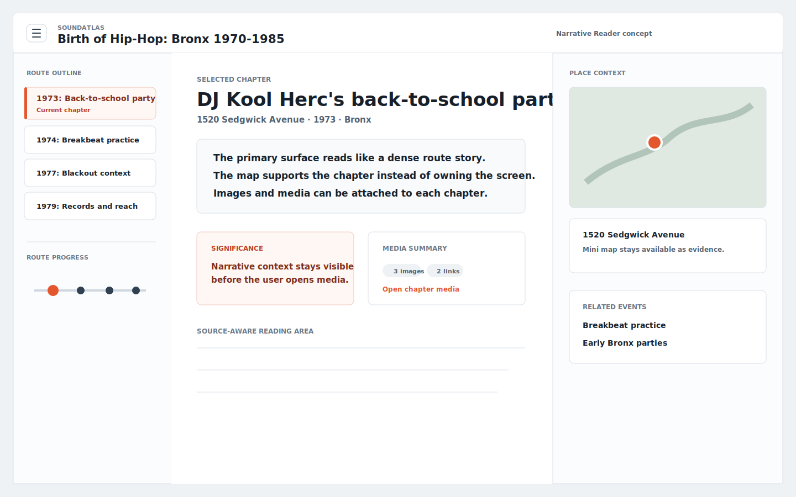
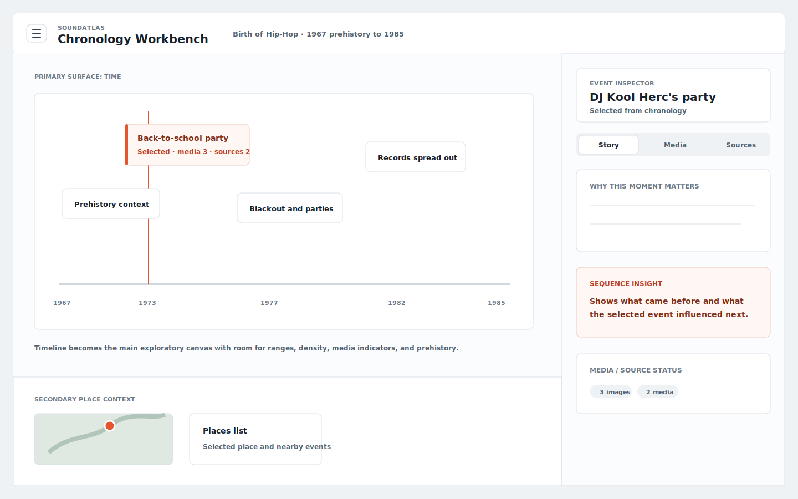
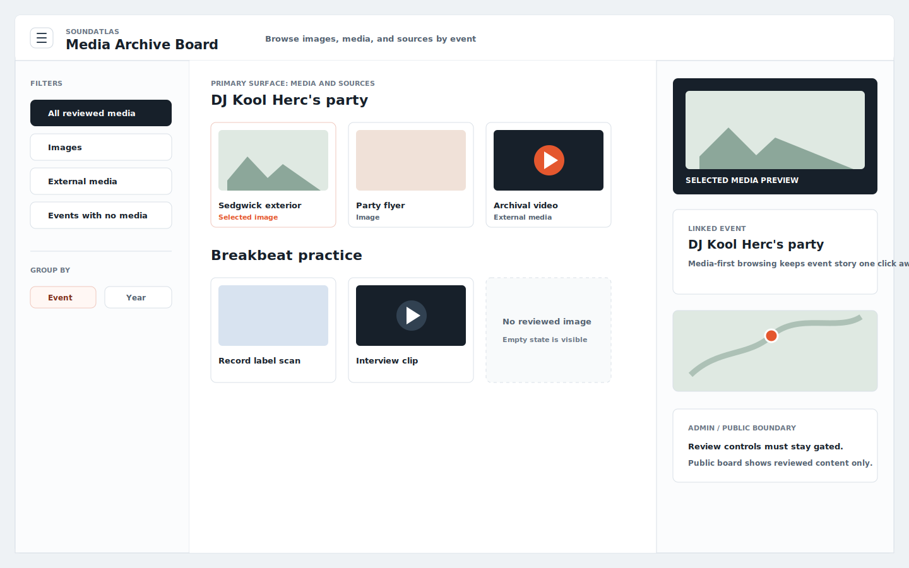

# Non Map First Design Exploration - 2026-06-27

This document uses `prompts/design-ux.md` to explore alternative main-screen concepts that are intentionally **not map first**.

The current baseline in `docs/design/current-frontend-design.md` remains map-first. These concepts are exploratory directions for deciding whether a different primary surface would better support story reading, chronology, or future media/image-heavy use.

## Assumptions

- Desktop is the primary design target for this exploration.
- The first screen is still the product experience, not a landing page.
- The same central state model should remain: selected route, selected event, visible events, selected place, sources, media, and review state.
- Seed data should drive all real event, route, media, and place content.
- The map remains available, but it is secondary context rather than the dominant surface.

## Concept A: Narrative Reader

### Core Idea

Make the selected route read like a dense documentary article with anchored event chapters. The main surface is the story sequence. The map becomes a compact spatial reference beside the current chapter.

### Best For

- First-time users who need guided understanding before spatial exploration.
- Routes with strong historical narrative.
- Future image/media additions, because media can live inside chapter modules without crowding a map.

### Layout

- Left rail: route outline and chapter/event list.
- Center: primary reading column with selected event story, significance, and inline source/media summaries.
- Right rail: compact place card, mini map, related events, and sources.
- Timeline: reduced to an event progress strip or chapter index.

### Interaction Model

- Selecting a chapter/event updates the center story, right-side mini map, media, and active route outline.
- The mini map is clickable, but secondary.
- Media opens in a focused overlay or a media tab inside the chapter.

### Strengths

- Strongest story comprehension.
- Gives images and media a natural home.
- Less risk that a narrow sidebar becomes overloaded.

### Risks

- Place exploration becomes less immediate.
- The app may feel closer to a publication than an interactive atlas.
- Needs strong event summaries and editorial structure to feel worth the space.

## Concept B: Chronology Workbench

### Core Idea

Make time the primary exploration surface. The route is presented as a detailed chronology with event density, selected-event detail, source/media status, and place context.

### Best For

- Comparing event order and influence.
- Routes with many events.
- Understanding prehistory, overlap, and multi-year ranges.

### Layout

- Top: compact app header and route controls.
- Main: large horizontal or vertical timeline canvas with event lanes.
- Right: event inspector with story/media/sources tabs.
- Bottom or side: mini map and place list as context.

### Interaction Model

- Selecting a timeline event updates the inspector and mini map.
- Drag/scroll timeline ranges for longer routes.
- Filters can show media-rich events, unreviewed media, places, or source confidence.

### Strengths

- Solves the current issue where the timeline is useful but spatially secondary.
- Better for routes with many events and overlapping ranges.
- Easy to add density states, clustering, and source/media indicators.

### Risks

- Less emotionally immediate than a story-first design.
- More complex timeline interaction design.
- Could feel like an admin/research tool if visual hierarchy is too technical.

## Concept C: Media Archive Board

### Core Idea

Make images, media links, and sources the primary exploration surface. Events become the organizing metadata behind a curated media board.

### Best For

- A future media-rich public experience.
- Admin review and curation workflows.
- Users browsing visual/audio evidence before reading full event narratives.

### Layout

- Left: route and filter rail.
- Center: media/image card grid grouped by event or year.
- Right: selected media/event inspector.
- Small map and timeline context appear inside the inspector.

### Interaction Model

- Selecting a media card updates the inspector and highlights the linked event.
- Filters switch between all media, images, external media, unreviewed, reviewed, and no-media events.
- Event story is available from the inspector, but not the default surface.

### Strengths

- Scales best when image and media volume grows.
- Supports admin mode naturally.
- Makes source/media gaps obvious.

### Risks

- Weakest for the current MVP if seed media remains sparse.
- Can drift away from place/time/story unless grouping is strict.
- Requires careful public/admin separation.

## Recommendation

For the current MVP, the strongest non-map-first alternative is **Concept A: Narrative Reader**.

It preserves the educational goal of the vertical slice, gives future media/images a better home than the current side panel, and still allows the map to remain visible as contextual evidence.

The strongest future-facing concept is **Concept C: Media Archive Board**, but it should wait until there is enough reviewed image/media content to justify making media the primary surface.

Concept B is useful if the project decides that chronology and sequence are more important than map exploration for the first product experience.

## Shared Implementation Implications

All three concepts should preserve the current shared state model:

- `selectedRouteId`
- `selectedEventId`
- visible route events
- selected place
- selected event media/images/sources

Likely affected components:

- `frontend/src/routes/+page.svelte`
- `frontend/src/lib/components/StoryPanel.svelte`
- `frontend/src/lib/components/Timeline.svelte`
- `frontend/src/lib/components/MapView.svelte`
- `frontend/src/lib/components/NavigationDrawer.svelte`
- possible new `EventInspector`, `RouteOutline`, `MediaBoard`, or `ChronologyCanvas` components

## Open Product Questions

1. Should SoundAtlas feel primarily like an atlas, a documentary reader, a chronology tool, or a media archive?
2. Should future public users start with a guided route story or with free exploration?
3. How much reviewed media/image content is expected for the first public MVP?
4. Should admin review remain in the drawer, or move to a dedicated media/archive mode later?
