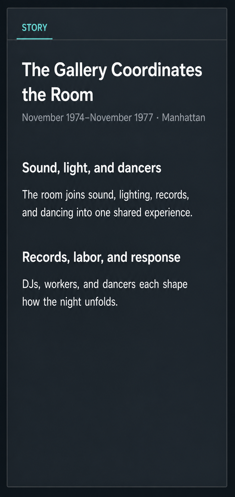

# Current Frontend Design

This document records the current intended design concept for the SoundAtlas frontend. It is a baseline for UX audits and redesign passes, not a record of every implemented detail.

Update this document when the intended product surface, design direction, state model, or component roles change.

## Purpose

The frontend should let a user explore New York music history through place, time, and story. For the MVP, the first successful experience is understanding **Birth of Hip-Hop: Bronx 1970-1985** through a coordinated map, route sequence timeline, route switching, and selected event inspector.

The first screen should be the product experience itself, not a landing page.

## Design Direction

The current direction is **Research Atlas with selected Story Explorer behavior**.

This means:

- Map-first exploration is the dominant interaction.
- A compact app header gives route orientation without overwhelming the map or selected event.
- The selected event inspector should have enough desktop width to read comfortably without making the map feel secondary.
- Timeline clarifies chronology and sequence.
- The event inspector explains the selected event in plain, source-aware language.
- Sources and media are discoverable but secondary to place/time/story understanding.
- Route context should stay compact and visible above the map without duplicating the inspector.
- The visual tone is dense, documentary, restrained, and useful.

The approved navigation target is illustrated in
[`persistent-route-multi-review-navigation.svg`](mockups/persistent-route-multi-review-navigation.svg).
It is a design target, not a statement that the current frontend already
implements published-only route filtering or a cross-route review list.

## Primary User Workflow

1. User opens the app.
2. The default route is selected.
3. The map shows relevant places and event markers.
4. The timeline shows the route event sequence.
5. User selects an event from the map, timeline, or inspector navigation.
6. Map, timeline, and event inspector update from the same selected event state.
7. User may focus any place within the selected event from the map or inspector.
8. User inspects the Event's ordered titled story or legacy prose, places,
   route context, sources, and media.

## Screen Structure

The current main screen is organized around:

- Compact app header: product name, geographic/time scope, active route title, route years, short route context, and API/status summary
- Navigation drawer: the only route-selection surface; it lists routes at the first level rather than opening a nested route screen
- Two route collections in editorial mode: `Routes` for published route versions and `Routes to review` for unpublished or changed review revisions
- Operational navigation: mode-specific media and route-review controls, with one active route or exact review revision at a time
- Map: primary spatial exploration surface
- Timeline: route sequence and selected event range
- Event inspector: selected event details, navigation, sources, related events, and media

The intended hierarchy is:

1. Active route and map context
2. Timeline sequence
3. Selected-event story and relationships
4. Navigation and mode-specific review tasks
5. Sources and media

## Navigation Across Modes

Route selection occurs only in navigation. The drawer directly lists selectable
route rows; it must not use a `Routes` parent item that opens a second-level
route screen. The header, map, timeline, and StoryPanel show the selected route
context but do not switch routes.

| Mode | First-level route navigation | Mode-specific operations |
| --- | --- | --- |
| Public static explorer | `Routes` lists published route versions | None; editorial and media review remain unavailable |
| API/admin explorer | `Routes` lists published route versions | Media/image review may span events from several routes |
| Editorial mode | `Routes` and `Routes to review` are separate first-level lists | Inspect and change one exact review revision; publish only that revision |

`Routes` names published route versions. `Routes to review` contains only routes
with no published revision or a current review revision different from the
published revision. A stable route can occur in both lists when those revisions
differ. Neither list makes several routes active on the map or timeline, and
approval and publication remain route- and revision-specific.

## State Model

The main page owns the shared exploration state:

- `routes`
- `places`
- `events`
- `connections`
- `selectedRouteId`
- `selectedEventId`
- `selectedPlaceId`
- `isLoading`
- `errorMessage`
- `isNavigationOpen`
- `navigationVariant`
- `activeNavigationItemId`
- `reviewSavingItemId`
- `reviewErrorMessage`

Derived state includes:

- visible events for the selected route
- chronologically ordered visible events
- selected event
- selected place
- selected route
- previous and next event
- selected-event connections
- timeline route and year range
- route event counts
- review queue items

The navigation target introduces a distinction between three kinds of route
state:

- **Active route:** the one route or review revision controlling the map,
  timeline, StoryPanel, detailed editorial review, and revision-bound
  publication action.
- **Published route list:** the first-level `Routes` navigation collection.
- **Review route list:** the separate first-level `Routes to review` collection.
  It selects editorial work but does not own approval or publication authority.

Map marker and polygon clicks, timeline clicks, route selection, inspector
navigation, StoryPanel place controls, related-event clicks, and keyboard
navigation use this shared state rather than separate local selection models.
The selected event remains the story identity; `selectedPlaceId` is constrained
to that event's places and falls back to `default_place_id` only when the
current focus is not valid for the event.

## Component Roles

### `frontend/src/routes/+page.svelte`

Owns data loading, shared selection state, derived selected event/place/route state, keyboard navigation, compact app header, desktop drawer state, and top-level layout.

### `NavigationDrawer`

Owns first-level route selection and mode-specific operations. `Routes` lists
published routes directly. Editorial mode adds a separately labelled `Routes to
review` list, whose rows select one exact review revision. No route row leads to
a second-level route subview. Public mode does not expose restricted review
actions; API/admin mode may expose media review; editorial mode exposes route
review and exact-revision publication controls.

### `Icon`

Provides the local line icons used by the drawer trigger and navigation drawer until a shared icon package or design system is introduced.

### `MapView`

Displays compositional event geography with route color, selected-event state,
and stronger focused-place state. It remains browser-safe around Leaflet
loading and does not require real map tiles for tests. It renders point markers,
shared Polygon/MultiPolygon place geometry, explicit relationship connectors,
selected-place chrome, and separate ambient borough context.

Map color hierarchy:

- Borough color describes ambient geography.
- Place polygon color and line style describe site or interpretive area context.
- Route color describes narrative selection through marker rings, selected-place chrome, and selected contextual polygon outlines.
- Route color should not dominate large map polygon fills; selected contextual polygons should keep semantic fills and use route color as an accent.

Shared geography follows `route-entry-spatial-presentation.md` and arrives
through the same API/static place data as point locations. When several visible
events share a clicked area, the current applicable event is preserved, a sole
matching event is selected, or a compact event chooser is shown.

### `Timeline`

Shows the route chronology and lets users select events. It should clarify event sequence and selected-event position. If the horizontal event-card strip remains as a fallback, it should keep the selected card centered in view.

### `RouteFilter`

Remains a reusable single-select route control, but it is not the approved
primary navigation surface for this slice. Route switching belongs in the
navigation drawer's first-level lists.

## Responsive And Accessibility Behavior

- Narrow screens retain a visible navigation trigger and direct first-level
  access to `Routes` and, in editorial mode, `Routes to review`; route
  selection must not disappear at a breakpoint or move into a nested subview.
- Active-route state must be conveyed by text or programmatic state as well as
  color.
- Route choices use descriptive accessible names and expose the current choice.
- Editorial readiness summaries distinguish ready, warning, blocked, draft,
  unavailable, loading, and error states without relying only on color.
- Moving between a review-route row and one route's detail preserves focus
  context and does not imply that more than one revision is being edited.

## Navigation Non-Goals

- A main-view route selector, a second-level route navigation screen, or a
  footer control solely for route selection.
- Showing several routes' events together on the map or timeline.
- Bulk editorial approval, bulk overrides, or bulk publication.
- A generalized dashboard, multi-user administration system, or new editorial
  workflow service.
- Moving media review into the public explorer.
- Treating `Routes to review` as an authority over route-specific review
  records.

### `StoryPanel`

Implements the selected event inspector. It explains the selected event with a
compact title-and-metadata header, stable previous/next navigation, Story,
Media, and Related tabs, readable sources, and a continuous story block. Its
Story tab exposes every event place as a keyboard/touch focus control and gives
area precision and place-relationship direction, context, and sources textual
equivalents. The media tab remains exploratory rather than an admin review
surface.

#### Event story hierarchy

The route narrative groups Events. Each selected Event is the complete
reader-facing chapter beneath its Event title. A section-based Event contains
one or more ordered story sections, each with a distinct Human-reviewed heading
and body.

The current hierarchy is: route narrative section -> Event title/chapter ->
ordered story-section heading and one rendered paragraph. `StoryPanel` renders
each story-section body as a single HTML paragraph. Multiple paragraphs beneath
one story-section heading are not currently supported. This mockup documents
current behavior; it does not authorize new route copy or a behavior change.

### `MediaEmbed`

Embeds playable media links when available. The active admin review workflow now lives in the navigation drawer; any embedded media controls should stay secondary to the public story-reading surface.

## Visual Principles

- Keep the map visually primary.
- Use compact, readable panels rather than marketing-style sections.
- Prefer restrained color and clear hierarchy over decorative styling.
- Keep typography dense enough for repeated research use.
- Make selected state obvious across map, timeline, and inspector.
- Keep sources visible but not louder than event understanding.
- Preserve usable empty, loading, and error states.
- Design laptop-size screens first, then preserve the workflow on mobile.

## Known Design Gaps

- The map does not yet feel dominant enough in the first viewport.
- First-level `Routes` and `Routes to review` navigation lists are approved
  design targets but are not yet implemented. The current frontend still uses a
  `Routes` item followed by a nested subview and has no cross-route review list.
- The Birth of Hip-Hop route range starts at 1970, while an early route event starts in 1967.
- Timeline selection has both ticks and event cards, which can feel visually busy.
- If the horizontal event-card strip remains, selected cards should stay centered so the fallback does not feel detached from the active selection.
- Map selected-event context is split between the compact route header, selected marker/place chrome, timeline, and inspector; it may still need a better single focal cue.
- Mobile behavior has an implemented ordering strategy, but first-level route
  navigation and the separate review-route list still require implementation
  and screenshot review.
- Public mode must continue to hide or gate editorial and media/image review actions.
- Public-facing image/media browsing still needs a clearer behavior definition for fixed preview dimensions, long media lists, lazy loading, and focused image/video inspection.

## Open Decisions

- How should pre-1970 hip-hop context be represented in route ranges and timeline layout?
- Should restricted drawer/admin items be hidden or disabled in public-facing contexts?
- What is the public-mode boundary for hiding or gating the admin drawer media/image review workflow?
- Should timeline event cards remain, become more compact, or move into the inspector?
- Should the route header be reduced further once the story inspector becomes more self-contained?

## Related Documents

- `docs/design/ux-workflow.md`
- `docs/design/route-entry-spatial-presentation.md`
- `prompts/design-ux.md`
- `docs/mvp-concept.md`
