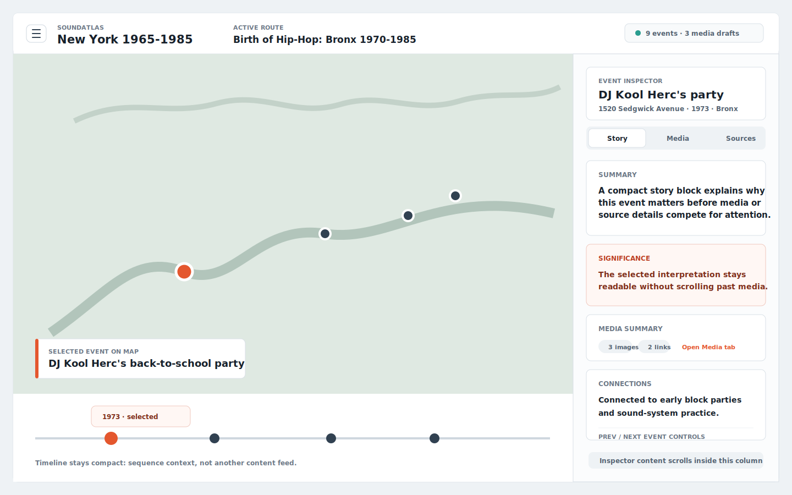
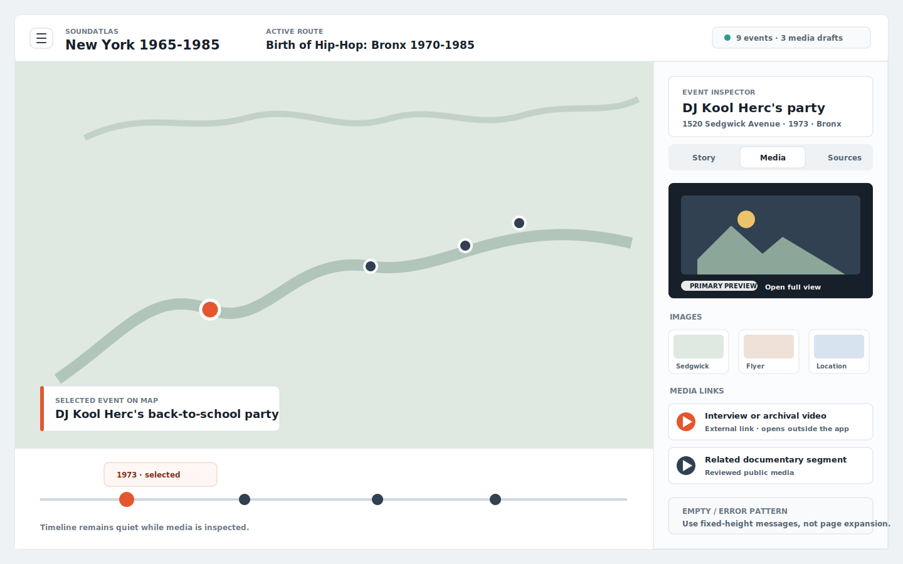

# Main Screen Media Structure Mockups

These mockups explore a scalable desktop structure for the SoundAtlas main screen when richer image and media content is added.

The recommendation is to keep the current map-first shell, but replace the right-side free-scrolling story column with a stricter event inspector:

- `Story` stays the default reading view.
- `Media` becomes a secondary tab with fixed preview dimensions and compact thumbnails.
- `Sources` remains a supporting detail view rather than competing with the map.
- Admin review stays in the navigation drawer and should not become the public media browser.

## Mockups

### Story Tab

This view keeps the map dominant while the selected event inspector provides compact story, significance, connections, and a small media summary.

### Media Tab

This view shows the recommended media structure: one stable preview area, compact image/media thumbnails, and source links below. Rich media does not expand the entire sidebar by default.

## Design Notes

- The inspector header should remain sticky while the tab content scrolls.
- Media cards use fixed aspect ratios to avoid layout jumps.
- The timeline remains visible, but visually quieter than the map and selected event.
- The drawer remains an overlay workflow for route switching and admin review actions.
- On smaller screens, the inspector tabs should become the main way to switch between story, media, and sources.
