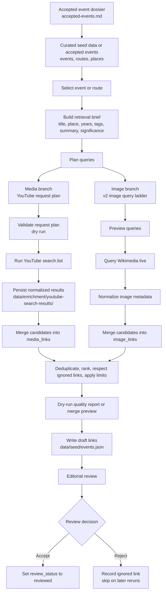

# Shared Media and Image Enrichment Workflow

## Purpose

This document describes the common enrichment pipeline for SoundAtlas external
media links and image links.

The current implementations differ by provider and target field:

- media enrichment writes `media_links`
- image enrichment writes `image_links`

The workflow is shared until the provider/type-specific branch. After that
split, each provider module owns its own search, parsing, rights mapping, and
candidate normalization.

## Shared Workflow



```text
accepted event dossier or seed data selection
-> retrieval brief generation
-> query planning
-> provider execution
-> candidate normalization
-> deduplication and ranking
-> dry-run quality report
-> merge into seed data
-> editorial review
```

## Shared Inputs

Both workflows should start from accepted events when route-folder editorial
work is available. The editorial handoff is:

- `docs/content/routes/<route-id>/accepted-events.md`

Current scripts still read curated seed data, so seed events used for
enrichment should trace back to an accepted-event dossier or an equivalent
human review decision.

Both workflows can use the same curated seed data:

- `data/seed/events.json`
- `data/seed/routes.json`
- `data/seed/places.json`

The shared retrieval brief can use:

- event title
- route title
- place name
- year range
- tags
- summary
- significance
- source leads and claim risks from `accepted-events.md`
- other known scene terms already present in the event text
- optional event-search-components from `data/enrichment/event-search-components/`

## Split Point

The process splits after query planning and before provider execution.

At that point:

- image enrichment selects image providers and image-specific query ladders
- media enrichment selects media providers and media-specific request plans

Provider code then owns:

- search URLs or request calls
- pagination
- response parsing
- thumbnail or preview extraction
- source-page extraction
- rights or license mapping
- provider-specific normalization into the shared link shape

## Shared Candidate Rules

Both workflows should follow the same candidate rules:

- keep generated links as `draft`
- never mark generated candidates as `reviewed`
- enrich accepted events only; do not enrich unresolved `maybe`, unresolved
  `merge`, or `reject` candidates
- preserve existing accepted links
- deduplicate by stable external URLs or equivalent provider identifiers
- skip rejected items through the event-level ignore list
- prefer no result over padding an event with weak generic matches

## Shared Review Boundary

Automation may write draft links, but editorial review decides what becomes
`reviewed`.

The review surface should:

- inspect historical relevance
- inspect source quality
- inspect attribution and rights metadata
- inspect whether the item belongs with the specific event

Rejected links are recorded in the event-level ignore list so reruns do not
immediately re-add the same item.

## Dry-Run Quality Reports

Use the quality report before writing enrichment changes when comparing query
plans, provider behavior, scoring changes, or merge limits.

The report is dry-run only: it computes candidate metrics and optional
comparisons without writing `data/seed/events.json`.

Media report:

```bash
cd backend
uv run python scripts/report_enrichment_quality.py --kind media --route-id birth-of-hip-hop
```

Media reports do not call the YouTube API. They read saved normalized result
files from `data/enrichment/youtube-search-results/`, or another directory
passed with `--results-dir`. To evaluate media query-planning changes, run the
new YouTube request plan first, save its results, and then compare reports. You
do not need to rerun the old query plan if old results or an old JSON report are
already saved.

Image report:

```bash
cd backend
uv run python scripts/report_enrichment_quality.py --kind image --route-id birth-of-hip-hop
```

Image reports currently call Wikimedia live because image provider results are
not yet persisted in a separate result directory.

Compare a new dry run to current seed links:

```bash
cd backend
uv run python scripts/report_enrichment_quality.py --kind image --route-id birth-of-hip-hop --baseline-from-seed
```

Compare a new dry run to a previously saved JSON report:

```bash
cd backend
mkdir -p ../data/enrichment/quality-reports
uv run python scripts/report_enrichment_quality.py --kind image --route-id birth-of-hip-hop --query-planner legacy --json > ../data/enrichment/quality-reports/image-legacy.json
uv run python scripts/report_enrichment_quality.py --kind image --route-id birth-of-hip-hop --query-planner v2 --compare-to ../data/enrichment/quality-reports/image-legacy.json
```

Tracked signals include candidate count, deduped count, ignored matches,
existing duplicates, limit drops, average specificity, average confidence,
provider/type mix, and image rights mix.

Warnings are review prompts, not failures:

- `no_candidates`: the run produced no reviewable candidates for the event.
- `all_candidates_ignored`: every deduped candidate matched the event's ignore list.
- `limit_reached`: valid candidates existed beyond the configured per-event limit.
- `only_low_specificity_candidates`: every selected candidate had weak event/place/query overlap.
- `only_low_confidence_candidates`: every selected candidate had low provider or scoring confidence.
- `playlist_only` or `no_videos`: media candidates contained playlists but no videos.
- `wrong_era_playlist`: at least one playlist candidate exposes explicit year or decade evidence outside the event's year range.
- `unknown_rights_status`: at least one image candidate lacks clear rights metadata.
- `missing_query`, `missing_title`, or `missing_source_url`: a candidate is missing useful review metadata.

Comparison output also highlights type-by-type shifts, new/lost candidate
identities, and quality direction per event.

## Seed Link Counts

Use the seed link count report when you want a quick inventory of how many
media links, image links, and ignored links each event currently has.

```bash
cd backend
uv run python scripts/report_seed_link_counts.py
```

Add `--route-id` or `--event-id` to narrow the report. Add `--json` when you
want the counts as structured output. The text report groups ignored links by
event and kind so repeated rejects read as one compact block per event. JSON
keeps the raw top-level `ignored_links` entries if you need the underlying
records.

## Image Workflow

Image enrichment currently uses a Wikimedia-first pass and plans queries from a
retrieval brief built from the event, route, and place data.

The image-specific docs are:

- `docs/enrichment/image/overview.md`
- `docs/enrichment/image/workflow-commands.md`

## Media Workflow

Media enrichment currently uses a YouTube-only MVP flow with curated request
plans and normalized result files.

The media-specific docs are:

- `docs/enrichment/media/overview.md`
- `docs/enrichment/media/workflow-commands.md`

## Practical Rule

If a step applies to both image and media enrichment, document it here once.
If a step only applies to one provider family or one target type, document it in
the relevant image or media doc instead.
