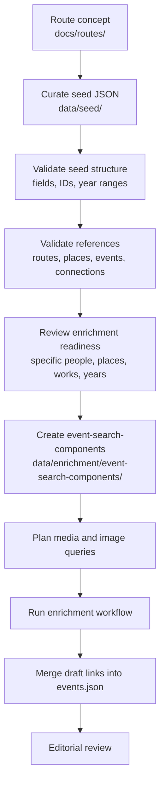

# Seed Data Workflow

## Purpose

This document describes how curated SoundAtlas seed data is created, validated,
and prepared for enrichment.

Seed data remains the editorial product layer. It should stay small,
human-readable, and stable. Retrieval-specific hints for media and image
enrichment should live outside the public seed files, under `data/enrichment/`,
when they become more detailed than normal event prose, tags, places, and
sources.

## Workflow



## Current Creation Flow

Seed creation is currently curator-led and prompt-assisted:

1. For non-trivial route or seed changes, start with `prompts/plan-feature.md`
   and save an approved local implementation plan record under
   `plans/records/` before editing multiple seed files.
2. Start from the MVP concept and a route concept in `docs/routes/`.
3. Add or update the smallest necessary seed files in `data/seed/`.
4. Keep stable lowercase, URL-safe IDs.
5. Keep event `summary` focused on what happened.
6. Keep event `significance` focused on why the event matters.
7. Add `source_urls`, even when source review is still incomplete.
8. Keep generated or uncertain records as `review_status: "draft"`.
9. Validate JSON shape and cross-file references through backend schema loading
   and tests.

The planning boundary for non-trivial seed work is documented in
`prompts/plan-feature.md`. The curation boundary for this work is documented in
`prompts/curate-seed-data.md`. Route-level creation guidance is documented in
`prompts/create-route.md`.

## Validation Layers

Structural validation is documented in `docs/seed-validation.md` and covers:

- required fields
- URL-safe IDs
- route, place, event, and connection references
- year ranges
- media and image link shapes
- draft versus reviewed status

Backend loading currently validates seed files through Pydantic schemas and the
`SeedRepository` reference checks. This confirms that the app can consume the
seed data, but it does not prove that enrichment queries will be high quality.

## Enrichment Readiness

Before generating media or image query plans, check whether the event gives the
retrieval layer enough precise terms.

Good enrichment-ready seed events usually include:

- a specific event title, not only a broad scene label
- explicit artist, DJ, group, venue, label, organization, or work names in prose
- clear year or year-range context
- a place that is specific enough for map display and query disambiguation
- tags that support the prose instead of replacing it
- source URLs for claims that may affect query wording

Common query-quality problems:

- only broad terms are available, such as `New York`, `Bronx`, `music`, or
  `scene`
- named works are not quoted or otherwise easy to detect
- a place name lacks city or borough context
- an event title contains a person or work, but the summary does not confirm why
  that term matters
- tags contain retrieval-critical names that are missing from the narrative text

## Retrieval Components

For enrichment-specific hints, use a separate component file instead of adding
retrieval fields to `data/seed/events.json`.

Preferred location:

```text
data/enrichment/event-search-components/<event-id>.json
```

The component schema is documented in:

```text
docs/media-retrieval/event-search-components.md
```

These components should capture structured terms that improve query planning:

- artists, places, works, organizations, techniques, and historical events
- genres, scenes, communities, practices, and route terms
- year phrases and decade context
- strong, supporting, risky, and avoid terms
- review notes for likely false positives

This keeps seed data clean while giving the enrichment workflow better inputs
for YouTube, Wikimedia, and future providers.

## Related Docs

- `docs/seed-validation.md`: seed schema and reference rules.
- `docs/enrichment-workflow.md`: shared media and image enrichment process.
- `docs/media-retrieval/event-search-components.md`: structured query-input
  model for enrichment.
- `docs/media-retrieval/query-planning.md`: YouTube query planning from event
  search components.
- `docs/image-retrieval/workflow-commands.md`: image enrichment commands.
